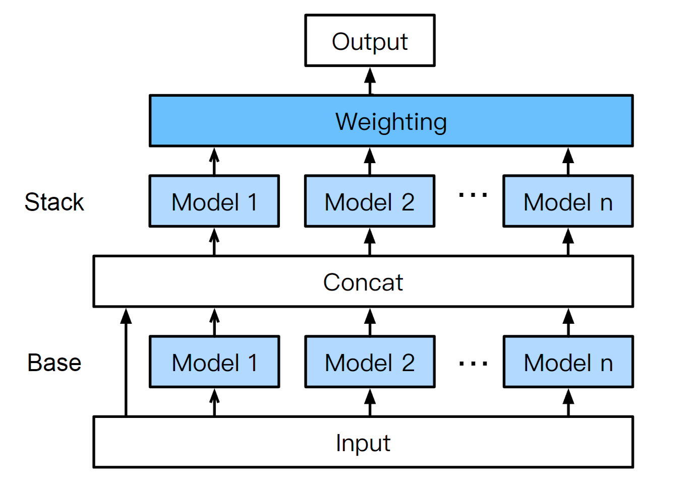

# [Team AutoML Grandmasters] First AutoML Grand Prix Competition Write-Up

Heyho everyone,

The following provides a write-up on the solution from the team "AutoML Grandmasters" for the [first competition](https://www.kaggle.com/competitions/playground-series-s4e5) of the [AutoML Grand Prix](https://www.kaggle.com/automl-grand-prix). 

TL;DR: We tried but ultimately failed to make automated feature engineering produce meaningful features for the competition's dataset, so we mainly focused on model selection to improve performance using a customized version of [AutoGluon](https://auto.gluon.ai/stable/index.html). Later, we manually switched to summary statistics as new features but, most critically, failed to use enough summary statistics and/or drop the original features.

## Summary of Contributions and Critical Elements of Success 

The parts of our workflow that contributed to our final solution and, thus, our success are summarized in the following. We further summarized and cleaned our final code in [this GitHub repository](https://github.com/AutoML-Grandmasters/First-AutoML-Grand-Prix/tree/main). 

1. **Feature Engineering**: We used summary statistics like others but did not drop the original features, [CODE](https://github.com/AutoML-Grandmasters/First-AutoML-Grand-Prix/blob/main/feature_engineering.py). 
2. **Model Selection**: We used AutoGluon with an optimized set of model hyperparameters, three small dirty hacks including a bug fix for early stopping LightGBM, and up to four stacking layers, [CODE](https://github.com/AutoML-Grandmasters/First-AutoML-Grand-Prix/blob/main/autogluon_code.py).
3. **Dummy AutoML Ensemble**: We created a merge of two separate AutoGluon runs with a simple weighted ensemble, [CODE](https://github.com/AutoML-Grandmasters/First-AutoML-Grand-Prix/blob/main/dirty_final_solution_merge.py).

### Overview Diagram
Given that our final solution mostly builds on AutoGluon, the best representative image/workflow diagram that I have in mind is the typical overview of AutoGluon (taken from Figure 2, [here](https://arxiv.org/pdf/2003.06505)):



### Details 

#### 1. Feature Engineering 
At some point during the competition, we were convinced that the underlying data and ML tasks were created by taking the mean of all features, and the result was the target. Then, noise from the synthetic data generation process (or some other form of noise) was added to this mean. 

The task we then need to solve for this competition is to learn to inverse the underlying noise function. IMO, this is what all the top-performing solutions did when using summary statistics. 

The result (https://www.kaggle.com/competitions/playground-series-s4e5/discussion/499274) shared by @ambrosm very much matched this understanding. After the deadline, I looked more into the potential search space of existing automated feature engineering pipelines like OpenFE, and, to the best of my knowledge, none would have discovered such a feature easily. That won't happen again!

When we finally came around to agree to start manual feature engineering, we already had a bigger AutoGluon run started and wanted to wait for its results. We observed that adding the summary statistics as features boosted the performance of our models just as much as the entire first stacking layer. In other words, stacking was also able to find similar meaningful features in the predictions of the prior layer but simply not good enough (in the 4th decimal) compared to the raw feature. 

In retrospect, this observation likely also biased us to not drop the original features, falsely hoping that stacking would just figure out which features to focus on.

In our final run, we added a trimmed mean as a feature, besides the features from @ambrosm:

```python
    from scipy.stats import trim_mean

    df["trim_mean"] = trim_mean(
        df[features],
        proportiontocut=0.075,
        axis=1,
    )
```
We believed this might lead to better learning to inverse the noise function. 

#### 2. Model Selection

For this competition, we used a "tuned" version of AutoGluon. Before we get into the details of our customization, here's a short philosophical comment on tuning AutoML systems. 

Fundamentally, as "expert" users of AutoGluon, we often use AutoGluon like we use scikit-learn -- as a framework (and not a tool) for machine learning. Thus, we often treat AutoGluon as the glue (Ba Dum Tss) that implements things like the validation procedure, robust parallelized model training, memory estimations, stacking, post hoc ensembling, and good early stopping. 

With this in mind, we can treat solving competitions as an algorithm configuration problem. We could also solve it automatically, but we are not that far. Instead, we use our experiences, meta-learning knowledge from [TabRepo](https://github.com/autogluon/tabrepo), and our human-in-the-loop setup (a.k.a. we look at the log files) to configure AutoGluon for the task at hand.  

For this competition, the dataset size immediately biased us toward GBDT models like LightGBM instead of neural networks. Sadly, even the most optimized neural networks took too long to converge for such a large dataset. 

In the end, we used AutoGluon with LightGBM, CatBoost, XGBoost, ExtraTrees, and a linear model. For each model, we picked the first two hyperparameter configurations from TabRepo's portfolios. 

Furthermore, we increased the max. number of iterations for all GBDTs to 50k, the number of iterations for greedy ensemble selection (used in the weighted ensemble) to 100, and fixed a bug related to early stopping in LightGBM. 

Then, we made AutoGluon use 5-repeated 8-fold cross-validation and stacking with up to 4 layers. We also disabled dynamic stacking. 

#### 3. Dummy AutoML Ensemble

In the end, we merged the test predictions of two AutoGluon runs (one with and one without the new features) by a simple weighted average. We found the optimal weights using a simple grid search (i.e., for loop) on the out-of-fold validation predictions. 

This can be understood as regularizing the second run of AutoGluon (with the new feature) with our old run (without them). If the second run overfits due to the new features, then merging the predictions might reduce the amount of overfitting.


## Things That Did Not Work

A lot of ideas did not work for this dataset, so here is just a short hall of shame:

* Useful automated feature generation.
* Transductive learning (this is generally hard to do for regression and needs more thought). 
* PCA/SVD of the features.

---

If you have any further questions or would like more details on some of our activities, let me know in the comments.

Best regards,

Lennart, on behalf of the "AutoML Grandmasters" 
